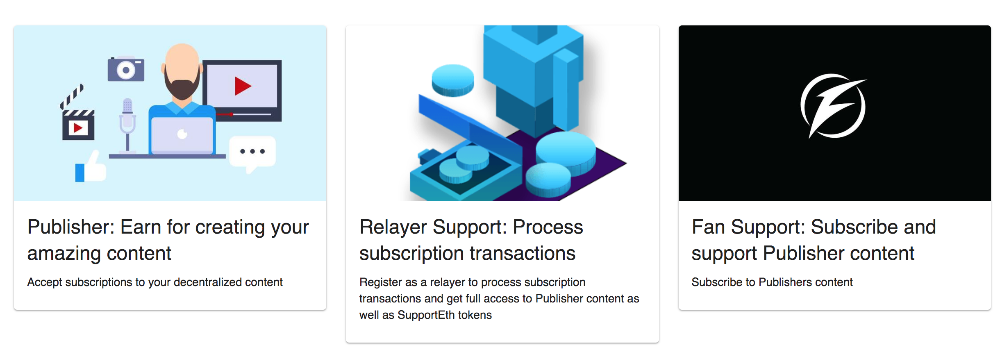

# Consensys Developer Program Autumn 2018

## Final Project: SupportEth - A Decentralized Patreon

* **Author**: Santiago Gonzalez Toral

### What is this project about?

SupportEth is a dApp which aims to serve as a decentralized Patreon platform where Publishers can share their contents and earn money with recurring payment subscriptions in any ERC20 token, and without any kind censorship from a central authority.

#### User stories

* In the website, A publisher can register a new `Publisher` account (smart contract), and start creating blog posts, which are not stored on a typical centralized storage but on IPFS. With his/her account, it is also possible to monitor the people that subscribe to their content, and receive recurring payment contributions from them on specific periods of time (e.g. monthly). Payments can be made in any ERC20 token the publisher prefers, and can be withdrawn at any time from the contract.

* Any person can create a `Fan` account (smart contract) to subscribe and contribute to publisher's content. To initialize a subscription, the user only needs to sign a transaction to authorize a relayer to process the payments through each subscription period he/she specified. Subscriptions cannot only be explicitly cancelled by the user, but in case their accounts is out of funds, the relayer will wait until the next period to try to process a new payment, so users don't need to lock a specific amount of funds prior authorizing the subscription. Int this way, SupportEth does not act as an escrow for subscriptions.

* Recurring payments need to be processed during different periods of time. Having a single relayer to process these transactions introduce some sort of centralization to the system. For this reason, any person can create a `Relayer` supporter account and contribute in some way (by paying the gas cost for processing the recurring payment) to the Publisher to keep delivering content. A relayer supporter can register their account address and download the relayer software to start processing recurring transactions for a specific Publisher. In exchange, the user have full access to published content, and earn some SupportEth tokens proportional to the gas they spend.

## Available Scripts

In the project directory, you can run:

### `npm start`

Runs the app in the development mode. 
Open [http://localhost:3000](http://localhost:3000) to view it in the browser.

The page will reload if you make edits. 
You will also see any lint errors in the console.

### `npm test`

Launches the test runner in the interactive watch mode. 
See the section about [running tests](https://facebook.github.io/create-react-app/docs/running-tests) for more information.

### `npm run build`

Builds the app for production to the `build` folder. 
It correctly bundles React in production mode and optimizes the build for the best performance.

The build is minified and the filenames include the hashes. 
Your app is ready to be deployed!

See the section about [deployment](https://facebook.github.io/create-react-app/docs/deployment) for more information.
